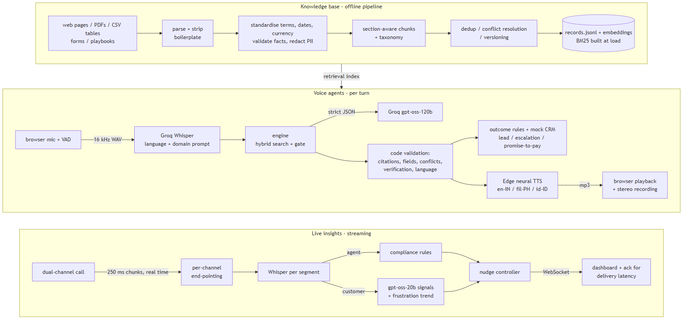
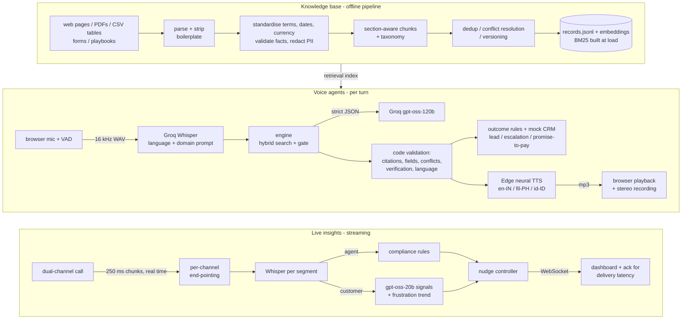

# Callwise - knowledge-grounded voice agents and live call insights

Callwise turns messy business content into a traceable knowledge base, puts it behind phone-style voice agents
for India, the Philippines and Indonesia, and analyses calls while they happen to nudge human agents.

| Part | What it does | Where |
|---|---|---|
| **1. Knowledge-grounded voice agent** | Health-insurance lead qualification (India, English). Web calling interface, KB-grounded answers with citations, code-enforced qualification, conflict handling, "information unavailable" fallback, human escalation, lead creation + mock-CRM summary. | `app/agent/`, `profiles/health_lead_in.yaml`, `web/index.html` |
| **2. Production-ready knowledge base** | Parses web pages, PDFs, tables, forms and playbooks; removes boilerplate, duplicates and obsolete content; resolves conflicts; standardises terms, dates and currency; redacts PII; versions every record; hybrid retrieval with a relevance gate; retrieval evaluation. | `app/kb/`, `data/raw/`, `web/knowledge.html` |
| **3. Native-language voice bots** | Philippines (life-insurance premium reminder, English/Filipino/Taglish) and Indonesia (motorcycle-financing installment reminder, formal/colloquial Bahasa Indonesia). Market-specific ASR configuration, native neural voices, localized scripts and rules, identity verification, language-preserving fallbacks. | `profiles/life_premium_ph.yaml`, `profiles/multifinance_id.yaml`, `app/asr_eval.py` |
| **4. Live insights and nudges** | Streams a dual-channel call at real-time speed in 250 ms chunks: end-pointing, streaming ASR, compliance rules + LLM signal extraction, nudge control (thresholds, de-duplication, cooldowns, priorities, expiry, repetition rule), WebSocket dashboard, P50/P95 latency and false-positive report. | `app/live/`, `live_scenarios/`, `web/insights.html` |

All companies, products, people and account data in this repository are **fictional sample data**
(Nivaran Health Insurance, Liwanag Life / Sinag Bank, Arunika Multifinance).

---

## Architecture



<details>
<summary>Mermaid source</summary>



</details>

### Why these components (all free)

| Need | Choice | Reason |
|---|---|---|
| LLM | Groq `openai/gpt-oss-120b` (agent), `openai/gpt-oss-20b` (live signals, simulated customer) | Only chat models on Groq's free tier; strict JSON-schema output; fast inference keeps voice turns short. Two models = two separate free-tier rate-limit buckets. |
| ASR | Groq `whisper-large-v3-turbo` / `whisper-large-v3` | Free tier, supports English, Tagalog and Indonesian, accepts a language code and a vocabulary prompt, returns confidence (`avg_logprob`, `no_speech_prob`). |
| TTS | Microsoft Edge neural voices via `edge-tts` | Free, no key, native `en-IN`, `fil-PH` and `id-ID` voices (plus `jv-ID`/`su-ID` used only as accent proxies in testing). |
| Embeddings | `paraphrase-multilingual-MiniLM-L12-v2` via fastembed (ONNX, CPU) | One multilingual model for English, Taglish and Indonesian; runs locally; ~220 MB. |
| Vector store | NumPy matrix + `rank-bm25` | ~124 records: a database would add operational weight with no benefit. |
| Server/UI | FastAPI + WebSocket, plain HTML/CSS/JS | No build step; one process serves the API, the calling interface and the dashboard. |

The free tier is the binding constraint (gpt-oss: 30 req/min, 8K tokens/min, 200K tokens/day; Whisper: 20 req/min).
`app/llm.py` paces requests and tokens per model in a sliding window (prompt-cache hits are not counted, as on
Groq). An agent turn goes to `gpt-oss-120b` and overflows to `gpt-oss-20b`'s separate quota instead of waiting. A
complete generation that Groq rejects on a formatting technicality (`tool_use_failed`, `json_validate_failed`) is
taken from the error body instead of being regenerated. Edge TTS requests that stall are raced with a second request
after 2.5 s.

---

## Setup

Requirements: Python 3.11+ (tested on 3.14), a microphone and Chrome or Edge for web calls, internet access
(Groq API, Edge TTS, one-time embedding-model download). No ffmpeg or GPU needed.

```bash
python -m venv .venv
# Windows: .venv\Scripts\activate      macOS/Linux: source .venv/bin/activate
pip install -r requirements.txt
cp .env.example .env                    # then paste a free key from https://console.groq.com/keys

python -m app.kb.ingest                 # build the knowledge bases (downloads the embedding model once)
python -m app.live.build_scenarios      # synthesise the 4 dual-channel test calls for live insights
uvicorn app.main:app --port 8000        # open http://localhost:8000
```

Pages: **Voice Agent** (`/`), **Call Log** (`/calls.html`), **Knowledge Base** (`/knowledge.html`),
**Live Insights** (`/insights.html`). Microphone access works on `localhost` without HTTPS.

## Producing the evidence

| Deliverable | Command | Output |
|---|---|---|
| Retrieval test (25 queries, verdicts, citations) | `python -m app.kb.evaluate` | `reports/retrieval_eval.md` |
| Recorded test calls, Q1 (3) and Q3 (2 per market) | `python -m app.agent.simulate` | `recordings/<call_id>/call.wav`, `transcript.md/json`, `reports/call_results.md` |
| Your own calls | Voice Agent page | same folders, listed in the Call Log |
| ASR evaluation per market (config vs baseline, accents) | `python -m app.asr_eval` | `reports/asr_report.md` |
| Live-insight latency and false-positive report | `python -m app.live.evaluate` (runs each scenario at real-time speed) | `reports/live_eval.md`, `reports/live_sessions/` |
| Live demo with delivery latency | Live Insights page | session summary on screen + `reports/live_sessions/` |

`app.agent.simulate` uses an LLM-played customer (personas in `tests/call_personas.yaml`) whose lines are spoken
by a native voice, transcribed by Whisper with the market's config and answered by the same engine as the web call.
The recordings are real pipeline runs, with simulated customers and not real people. Each call is checked
automatically (e.g. "objection answered with a cited objection record", "escalated", "conflict detected").
It uses roughly 120-150K agent tokens, which fits the free daily quota. Personas can be run one at a time:
`python -m app.agent.simulate in_cooperative`.

## Results measured so far

- **Retrieval** (`reports/retrieval_eval.md`, 25 queries across 3 collections, product / policy / qualification /
  FAQ / objection / pricing / claims / out-of-scope): **22 correct, 3 partially correct, 0 incorrect**; all 5
  out-of-scope questions are correctly rejected by the relevance gate; median retrieval latency ~9 ms on CPU.
  The gate thresholds were calibrated on this same set (no held-out set), so treat this as a sanity check rather
  than a generalisation estimate.
- **Ingestion** (health_in): 17 sources → 76 active records; 6 duplicates removed (repeated "Why choose" blocks,
  near-duplicate archived FAQs), 1 conflict superseded (2024 free-look period of 15 days vs current 30 days),
  1 record quarantined for an obvious source error ("maximum entry age 755 years"), 1 obsolete campaign removed,
  2 extraction failures flagged (image-only scanned PDF, truncated PDF), 7 PII entities redacted, CRM export excluded.

Voice-call, ASR and live-latency numbers need a Groq key. They are produced by the commands above, and nothing in
this repository reports them in advance.

---

## Repository layout

```
app/
  config.py llm.py tts.py audio.py metrics.py main.py
  kb/       parsers.py cleaning.py pii.py dedup.py ingest.py store.py evaluate.py
  agent/    engine.py rules.py crm.py simulate.py
  live/     segmenter.py signals.py nudges.py pipeline.py build_scenarios.py evaluate.py
  asr_eval.py
profiles/         agent configs: script, business rules, fields, ASR/TTS, test account
data/raw/         source content per collection + sources.json manifests (provenance, authority, glossary)
data/kb/          generated records.jsonl, report.json (+ index files, git-ignored)
data/eval/        retrieval test queries          data/asr_eval/   ASR test utterances
tests/            simulated customer personas      live_scenarios/  live-insight test calls + ground truth
web/              calling interface, call log, KB explorer, live dashboard
docs/             design notes per part            reports/         generated evaluation reports
```

Design notes: [Knowledge base](docs/knowledge_base.md) · [Voice agent](docs/voice_agent.md) ·
[Localization (PH/ID)](docs/localization.md) · [Live insights](docs/live_insights.md)

## Known limitations

- **Half-duplex calls**: the agent does not listen while it speaks (no barge-in). This avoids echo-triggered
  turns without server-side echo cancellation. There is no telephone number; calls use the web interface.
- **Free-tier rate limits** cap throughput: one turn uses ~1.2-2.4K tokens and each gpt-oss model allows 8K/min.
  Bursty turns are served by gpt-oss-20b (lower quality than 120b); if both quotas are exhausted, a turn waits for
  capacity, and that wait is reported in the per-turn latency.
- **Localisation** was written without native-speaker review; Taglish and Indonesian scripts need review by
  native speakers and local compliance before production use (see `docs/localization.md`).
- **Accent testing** uses Javanese/Sundanese neural voices reading Indonesian as a proxy; real regional speakers
  are needed (drop recordings into `data/asr_eval/human/` and re-run `app.asr_eval`).
- **Energy-based VAD** can split speech on noisy lines; downstream confidence filters compensate, but a neural
  VAD would be better.
- **Retrieval evaluation** is small and was used for calibration; a larger labelled set is needed.
- **Live-insight playbooks and rules** are English health-insurance specific.

## Production-improvement plan

1. Telephony: SIP/PSTN via a media-streaming provider, full-duplex audio with barge-in and server-side echo
   cancellation, warm transfer to human agents instead of callback tickets.
2. Streaming ASR with partial hypotheses (self-hosted faster-whisper or a streaming provider) and a neural VAD;
   this would cut end-pointing and ASR latency for both the agent and live insights.
3. Paid inference tier or self-hosted models, response caching for frequent FAQ answers, prompt caching.
4. Knowledge base: OCR for scanned PDFs, a scheduled crawler with change detection, reviewer workflow for
   quarantined/conflicting records, larger labelled retrieval set, cross-encoder re-ranking, tombstones for
   removed records.
5. State in Redis/Postgres instead of process memory and JSONL; real CRM/webhook integrations; audit logging.
6. Native-speaker and compliance review per market; consent capture; regulator-specific disclosure checklists.
7. Monitoring: per-turn latency, grounding rate, fallback/escalation rates, nudge acceptance rate, drift alerts.

## Video walkthrough outline

1. Overview and architecture (this README diagram).
2. Knowledge Base page: sources table (boilerplate, failures, PII), dedup/conflict/quarantine tab, a live search
   that passes the gate vs an out-of-scope query that does not, retrieval evaluation tab.
3. Voice Agent: a live India call covering an objection, an out-of-scope question ("claim settlement ratio") and
   a request for a human; show citations, conflict confirmation, outcome and the CRM record in the Call Log.
4. Philippines and Indonesia agents: Taglish and colloquial Indonesian calls, identity verification, localized
   fallback, plus `reports/asr_report.md`.
5. Live Insights: compliance and missed cross-sell scenarios, then the noisy call (quiet dashboard), the
   suppression log and the latency table; `reports/live_eval.md`.
6. Failure handling, limitations and the production plan.
